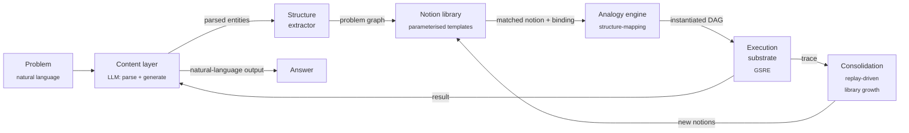

# notion-space

> **Notion-Based Reasoning System (NBRS)** — a research programme on cross-domain procedural transfer via structure–content decomposition.
>
> 📄 [Read the proof (PDF)](https://aryan-cs.github.io/notion-space/proof.pdf) · 📋 [Read the proposal](https://aryan-cs.github.io/notion-space/PROPOSAL.md) · 🗂️ [Source on GitHub](https://github.com/aryan-cs/notion-space)

This repository hosts the research proposal, formal theory, and (in due course) the implementation of NBRS. The architecture is motivated by the cognitive-map factorisation observed in the hippocampal–entorhinal system and by the structure-mapping account of analogy. The empirical programme targets two cross-domain transfer demonstrations: ARC-AGI subset performance and cross-discipline scientific-equilibrium analogy.

---

## What is NBRS, in one paragraph?

Contemporary large language models fail at *transfer* — applying an abstract procedure learned in one domain to a structurally analogous problem in a different domain. The diagnosis: standard transformers blend the *structure* of a problem (its relational scaffolding) with its *content* (the specific values, types, surface vocabulary) in a single representation, with no way to factor one from the other. NBRS proposes an architecture that maintains an explicit, content-independent library of abstract procedures — **notions**: parameterised relational templates over typed operations — induced from few examples, stored as transferable abstractions, and applied to new problems via structure-mapping. An LLM handles content (parsing, value supply, output generation); a structural layer maintains the notion library and selects, binds, and instantiates notions; instantiated notions execute on a deterministic typed-DAG executor (the GSRE).

---

## Why this matters

If the hypothesis holds:

1. **Cross-domain procedural transfer becomes mechanically explicit.** A notion learned from mechanical equilibrium problems applies, without retraining, to market equilibrium, chemical equilibrium, and Nash equilibrium problems — because the structural template is the same and only the bindings differ.
2. **Sample-efficient abstraction.** The notion-induction process abstracts patterns from a handful of traces (the cognitive-map analogue is hippocampal replay), enabling the library to grow without massive retraining.
3. **Localised failure attribution.** Every failure is attributable to a specific component: wrong notion selected, wrong binding constructed, executor error on a primitive, or type mismatch. Monolithic LLMs do not admit this kind of failure analysis.

The architecture is grounded in two converging lines of evidence:

- **Cognitive-map neuroscience.** The Tolman–Eichenbaum Machine (Whittington et al., *Cell* 2020) shows hippocampal–entorhinal circuits factor structure from content. Constantinescu et al. (*Science* 2016) demonstrate the same grid-cell apparatus organises conceptual spaces, not just physical ones.
- **Structure-mapping theory.** Gentner's account of analogy as relational alignment (1983), implemented in the Structure-Mapping Engine, predicts exactly the transfer humans display and LLMs lack.

The proof at [`proof.pdf`](https://aryan-cs.github.io/notion-space/proof.pdf) develops the formal theory.

---

## Architecture in 30 seconds



The five core components, each with a single responsibility:

| Component | Role |
|-----------|------|
| **Content layer** (LLM) | Parse problems, supply values, generate output. No multi-step reasoning. |
| **Structure extractor** | Convert parsed problems into typed relational graphs. |
| **Notion library** | Store parameterised relational templates (type, value, and operator variables). |
| **Analogy engine** | Match problem graphs to notions via structural alignment. |
| **Execution substrate** (GSRE) | Deterministically run instantiated notion graphs. |

A sixth component, **consolidation**, periodically abstracts new notions from successful traces — the hippocampal-replay analogue.

---

## The empirical programme

Two cross-domain transfer demonstrations, each chosen to test the central hypothesis directly.

| Demonstration | What's tested | Headline claim |
|---------------|--------------|----------------|
| **ARC-AGI subset** | Whether mined notions transfer from one set of ARC tasks to a held-out set. | Match or exceed frontier-LLM performance on the chosen subset; ablations attribute the win to the notion library. |
| **Scientific equilibrium analogy** | Whether a notion induced from mechanical-equilibrium problems applies to market, chemical, predator–prey, and Nash equilibrium problems. | Substantively higher cross-discipline transfer than frontier-LLM baselines, with no economic/chemical/biological/game-theoretic training examples. |

Diagnostics accompany each: notion-induction efficiency curves, analogy-engine accuracy breakdowns, per-primitive error rate and correlation structure on the executor, marginal-invariance divergence, and library-ablation studies.

The long form is in [`PROPOSAL.md`](https://aryan-cs.github.io/notion-space/PROPOSAL.md).

---

## Repository layout

```
notion-space/
├── README.md               ← you are here
└── docs/                   ← served by GitHub Pages
    ├── PROPOSAL.md         ← research roadmap (the canonical proposal)
    ├── proof.tex           ← formal theory (LaTeX source)
    └── proof.pdf           ← compiled PDF (run tectonic to regenerate)
```

When code lands, the expected structure is:

```
notion-space/
├── nbrs/                   ← Python package
│   ├── executor/           ← GSRE: the typed-DAG executor (Algorithm A.1)
│   ├── primitives/         ← primitive library + oracle semantics
│   ├── notions/            ← notion data structure, instantiation, composition
│   ├── extractor/          ← LLM-backed structure extractor
│   ├── analogy/            ← structure-mapping analogy engine
│   ├── consolidation/      ← replay-driven library growth
│   └── content/            ← LLM content layer wrapper
├── benchmarks/
│   ├── arc/                ← ARC-AGI subset adapter + harness
│   └── equilibrium/        ← cross-discipline equilibrium tasks
├── experiments/            ← training + eval scripts
├── tests/
└── pyproject.toml
```

---

## How to read the documents

You probably want, in order:

1. **[README.md](README.md)** *(this file)* — five-minute orientation.
2. **[PROPOSAL.md](https://aryan-cs.github.io/notion-space/PROPOSAL.md)** — the research roadmap. Architectural hypothesis, the two empirical demonstrations with scope and success criteria, work phases, open problems. Approximately 20-minute read.
3. **[proof.pdf](https://aryan-cs.github.io/notion-space/proof.pdf)** — the formal theory. Definitions of notions, instantiation, structural binding, and analogical mapping; the architectural specification; execution guarantees inherited from the GSRE; the cross-domain transfer property; the full empirical programme.

If you only have time for two sections of the proof, read **§5 (Architecture)** for the system specification and **§10 (Empirical Programme)** for the headline demonstrations. The cognitive-map and structure-mapping motivation lives in §1–2; the formal preliminaries and executor inheritance are in §3–7.

---

## Building the proof PDF

The proof is standard LaTeX and compiles cleanly with [Tectonic](https://tectonic-typesetting.github.io/), which downloads required packages on first use.

```bash
# install once
brew install tectonic           # macOS
# or follow instructions for your platform

# compile
cd docs
tectonic proof.tex
```

This produces `docs/proof.pdf`. The pre-compiled PDF is committed so casual readers do not need a LaTeX toolchain.

A traditional `pdflatex` or `latexmk` toolchain works equivalently:

```bash
cd docs && latexmk -pdf proof.tex
```

---

## Status

| Milestone | State |
|-----------|-------|
| Architectural pivot to structure–content factorisation | ✅ done |
| Formal theory of notions, instantiation, transfer | ✅ done |
| Empirical programme defined (ARC-AGI + equilibrium analogy) | ✅ done |
| Executor (GSRE) reference implementation | ⏳ pending |
| Notion data structure + instantiation pipeline | ⏳ pending |
| Analogy engine v0 (synthetic data training) | ⏳ pending |
| Notion induction v0 (toy corpus) | ⏳ pending |
| ARC-AGI demonstration | ⏳ blocked on v0 components |
| Scientific equilibrium demonstration | ⏳ blocked on ARC demonstration |
| Consolidation loop (autonomous library growth) | ⏳ long-term |

---

## A note on framing

NBRS makes a *structural* claim: that the absence of an explicit content-independent layer is what prevents contemporary LLMs from doing the kind of cross-domain transfer humans do. The architecture is the proposed bridge. This is not a claim about scale, and it is not a claim about emergent capabilities at the frontier. It is an architectural commitment with falsifiable empirical predictions.

If you are a reviewer or collaborator, the right places to push back are: (i) on the formal commitments in `docs/proof.pdf`, particularly the structural-dominance proposition (§9.1) and the inherited correctness of instantiated notions (§6.2); (ii) on the choice of benchmarks (§10) and whether they cleanly test the transfer hypothesis. Empirical disagreement is welcome but, given that the experiments have not yet been run, premature.

---

## Citation

A formal preprint will follow the empirical results. For now, please cite the repository:

```
@misc{nbrs2026,
  title  = {Notion-Based Reasoning System (NBRS): Cross-Domain Procedural Transfer via Structure--Content Decomposition},
  author = {Aryan Gupta},
  year   = {2026},
  note   = {\url{https://github.com/aryan-cs/notion-space}}
}
```

---

## License

To be determined. Until a license file is added, treat the contents as "all rights reserved" with permission granted only for reading and academic discussion. A permissive open-source license will be added before any code is published.
